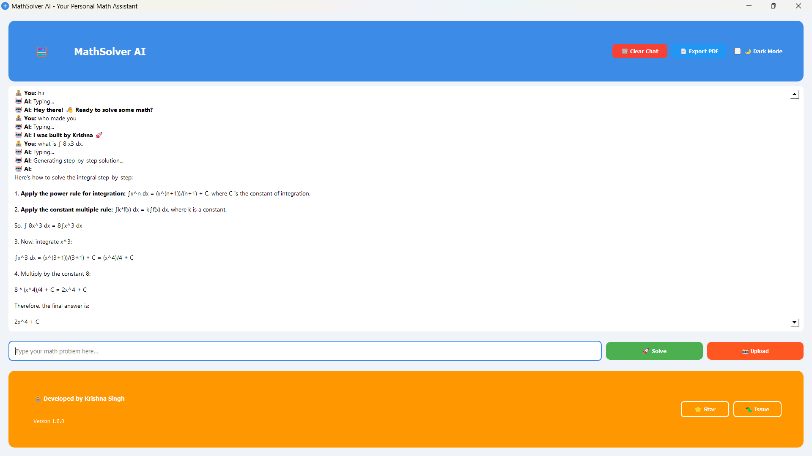

# MathSolver AI

A modern, user-friendly desktop application that helps you solve math problems using AI. Built with Python and PyQt5, it provides step-by-step solutions to mathematical problems and can even read problems from images.



## Features

- 🤖 AI-powered math problem solving
- 📸 Image-to-text conversion for math problems
- 🌙 Dark/Light mode
- 📄 Export solutions as PDF
- 💬 Interactive chat interface
- 🎯 Step-by-step solutions
- 🎨 Modern, responsive UI

## Installation

1. Clone the repository:
```bash
git clone https://github.com/Krishna-singh18/mathsolver-ai.git
cd mathsolver-ai
```

2. Install the required dependencies:
```bash
pip install -r requirements.txt
```

3. Set up your API key:
   - Create a `.env` file in the project root
   - Add your Gemini API key:
   ```
   GEMINI_API_KEY=your_api_key_here
   ```
   - Replace `your_api_key_here` with your actual Gemini API key

4. Run the application:
```bash
python main7.py
```

## Requirements

- Python 3.8+
- PyQt5
- google-generativeai
- Pillow
- reportlab
- python-dotenv

## Usage

1. Type your math problem in the text input field and press Enter or click "Solve"
2. Upload an image containing a math problem using the "Upload Image" button
3. View the step-by-step solution in the chat area
4. Export your solutions as PDF using the "Export PDF" button
5. Toggle between light and dark mode using the theme switch

## Contributing

Contributions are welcome! Please feel free to submit a Pull Request.

## License

This project is licensed under the MIT License - see the [LICENSE](LICENSE) file for details.

## Acknowledgments

- Built with ❤️ by Krishna Singh
- Powered by Google's Gemini AI
- Inspired by the need for accessible math education

## Support

If you find this project helpful, please consider giving it a ⭐ on GitHub! 